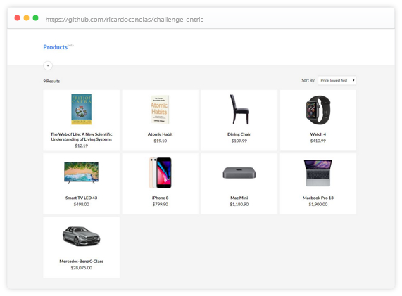

# ⚓ Challenge / Entria

Challenge by: [https://github.com/entria/jobs](https://github.com/entria/jobs)

## Description:

- [x] Create a List and Detail view for some model (e.g: todos, posts, products)
- [x] it should use React
- [x] it should use inline style
- [x] it should be open sourced on your github repo

### **Extras**

- [ ] Also Implement in React Native
- [ ] it should use ReactNavigation
- [ ] Implement code splitting using react-loadable
- [ ] Optimize webpack
- [x] Create a [storybook] with your components
- [ ] Test your components with [jest]

## Getting Started

### 👉🏻 Prerequisites

* [Git]
* [NPM] or [Yarn]

### 👉🏻 Installing

1. Clone this repository using `git clone`
2. Onto the **frontend/** directory, install the dependecies using `npm install` or `yarn install`

The website will be available at http://localhost:3000

## License

This project is licensed under the MIT License - see the [LICENSE](LICENSE) file for details.

[storybook]: https://github.com/storybooks/storybook
[jest]: https://jest-everywhere.now.sh
[git]: https://git-scm.com
[npm]: https://www.npmjs.com/get-npm
[yarn]: https://yarnpkg.com